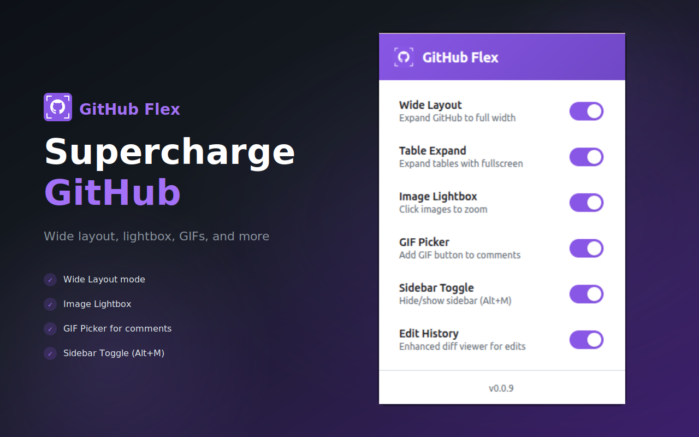
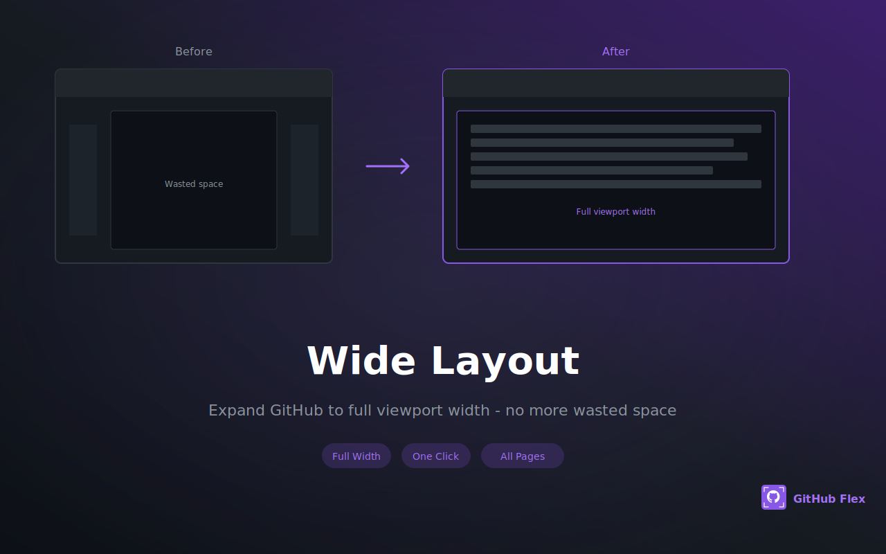
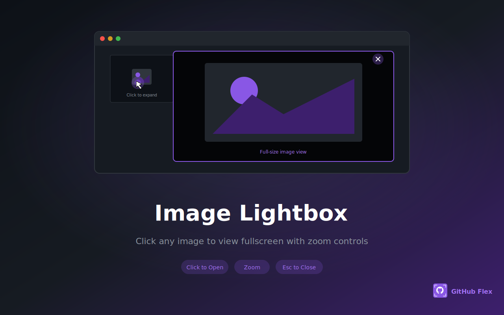
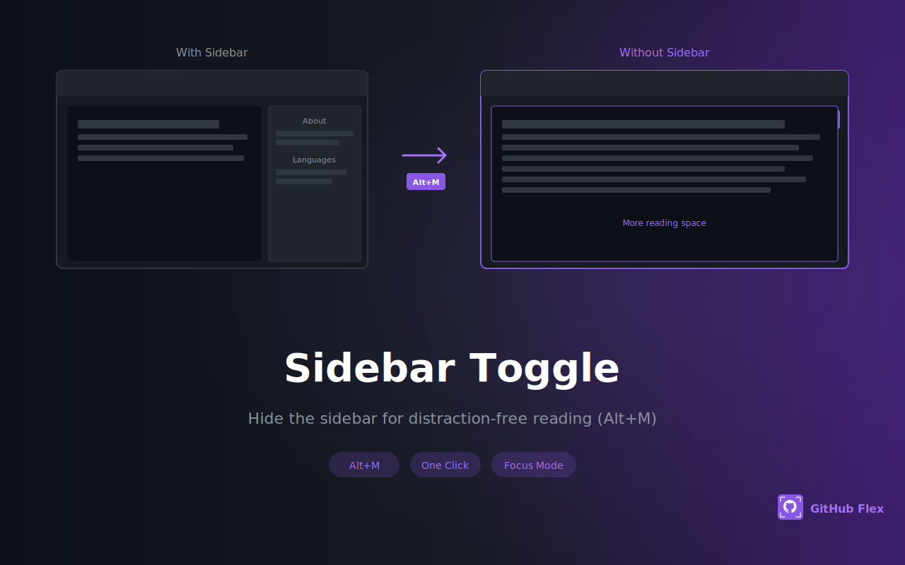

# GitHub Flex

[](https://github.com/lamngockhuong/github-flex/releases)
[](https://github.com/lamngockhuong/github-flex/actions/workflows/ci.yml)
[](LICENSE)
[](https://chromewebstore.google.com/detail/github-flex/iechckkdnjmdnpbdohhnmojofcbfnemc)
[](https://addons.mozilla.org/en-US/firefox/addon/github-flex/)
[](https://github-flex.khuong.dev)

<a href="https://unikorn.vn/p/github-flex?ref=embed-github-flex" target="_blank"></a>
<a href="https://launch.j2team.dev/products/github-flex-enhance-your-github-experience?utm_source=badge-launched&utm_medium=badge&utm_campaign=badge-github-flex-enhance-your-github-experience" target="_blank"></a>

A cross-browser extension (Chrome & Firefox) that enhances GitHub's interface with productivity features.

<p align="center">
  
</p>

## Features

- **Wide Layout** - Expands GitHub to full viewport width
- **Table Expand** - Expandable tables with persistent state
- **Image Lightbox** - Click images to view in fullscreen overlay
- **GIF Picker** - Insert GIFs in comments and issues
- **Sidebar Toggle** - Hide/show sidebar with button or `Alt+M` shortcut
- **Edit History** - Enhanced diff viewer with split/unified/preview modes for comment edits

<p align="center">
  
  
</p>
<p align="center">
  
  
</p>

## Installation

### Chrome Web Store

Install directly from the [Chrome Web Store](https://chromewebstore.google.com/detail/github-flex/iechckkdnjmdnpbdohhnmojofcbfnemc).

### Firefox Add-ons

Install directly from [Firefox Add-ons](https://addons.mozilla.org/en-US/firefox/addon/github-flex/).

### From Source

```bash
git clone https://github.com/lamngockhuong/github-flex.git
cd github-flex
pnpm install
pnpm build
```

Then load in your browser:

**Chrome:**

1. Open `chrome://extensions/`
2. Enable **Developer mode** (top right)
3. Click **Load unpacked**
4. Select the `dist/chrome/` folder

**Firefox:**

1. Open `about:debugging#/runtime/this-firefox`
2. Click **Load Temporary Add-on**
3. Select any file in the `dist/firefox/` folder

## Development

```bash
pnpm dev              # Build both browsers with watch mode
pnpm build            # Production build for both browsers
pnpm build:chrome     # Build Chrome only
pnpm build:firefox    # Build Firefox only
pnpm lint             # Check code style
pnpm lint:fix         # Auto-fix issues
pnpm lint:firefox     # Lint Firefox build with web-ext
pnpm test             # Run tests
```

### Publishing to Firefox Add-ons

When submitting a new version to [Firefox Add-ons](https://addons.mozilla.org/), Mozilla requires source code upload because we use esbuild to bundle. Create the source zip with:

```bash
zip -r github-flex-source.zip src/ scripts/ package.json pnpm-lock.yaml biome.json README.md LICENSE manifest.json
```

## Languages

- English (default)
- Vietnamese (Tiếng Việt)
- Japanese (日本語)

The extension automatically displays in the browser's language if supported.

## Tech Stack

- Manifest V3 (Chrome 88+, Firefox 112+)
- webextension-polyfill (cross-browser API compatibility)
- Vanilla JavaScript (ES Modules)
- esbuild (bundler)
- Biome (linter/formatter)
- Vitest (testing)

## Sponsor

If you find this extension useful, consider supporting its development:

[](https://github.com/sponsors/lamngockhuong)
[](https://buymeacoffee.com/lamngockhuong)
[](https://me.momo.vn/khuong)

## License

[MIT](LICENSE)
