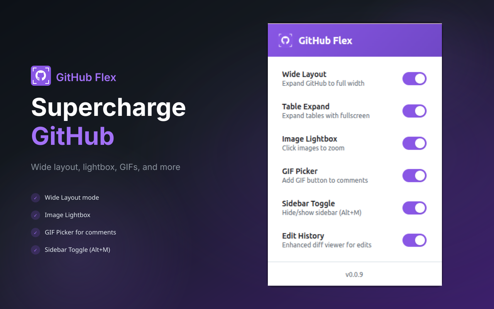
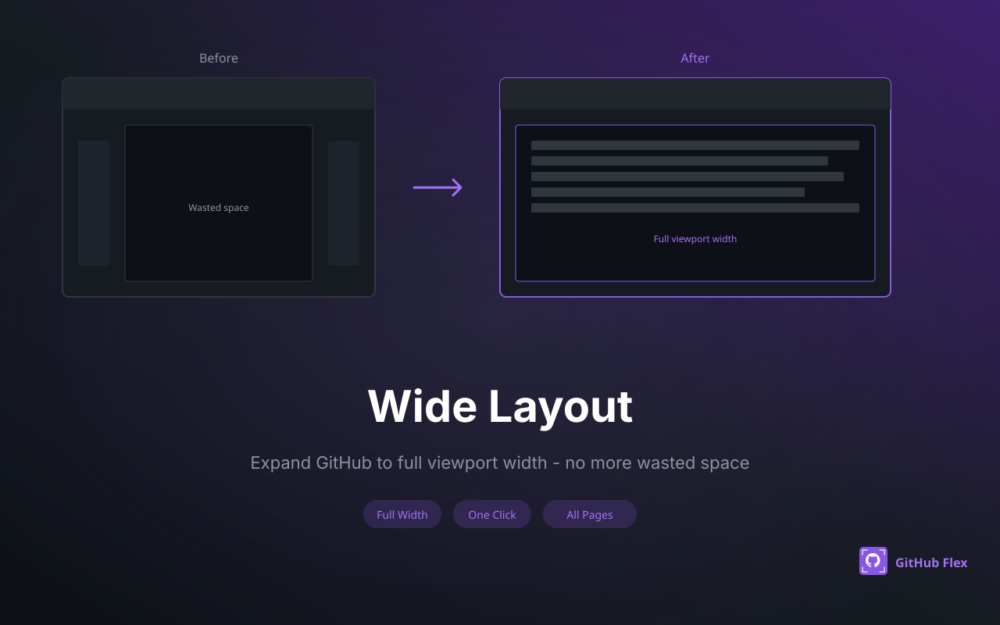
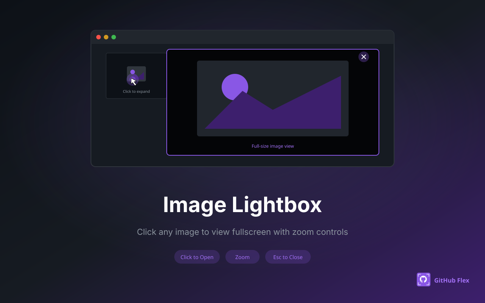
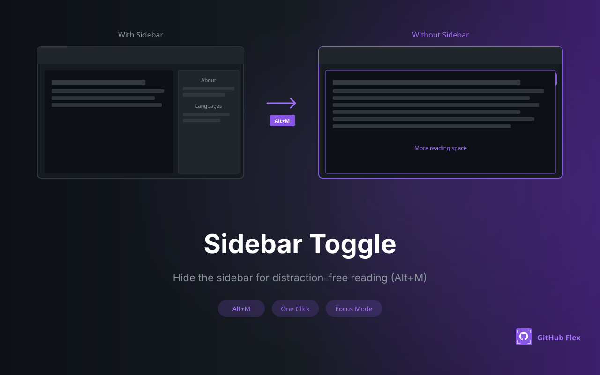

🇬🇧 [English](README.md) | 🇻🇳 **Tiếng Việt** | 🇯🇵 [日本語](README.ja.md)

# GitHub Flex

<p align="center">
  <a href="https://chromewebstore.google.com/detail/github-flex/iechckkdnjmdnpbdohhnmojofcbfnemc">
    
  </a>
  <a href="https://chromewebstore.google.com/detail/github-flex/iechckkdnjmdnpbdohhnmojofcbfnemc">
    
  </a>
  <a href="https://chromewebstore.google.com/detail/github-flex/iechckkdnjmdnpbdohhnmojofcbfnemc">
    
  </a>
  <a href="https://addons.mozilla.org/en-US/firefox/addon/github-flex/">
    
  </a>
  <a href="https://addons.mozilla.org/en-US/firefox/addon/github-flex/">
    
  </a>
  <a href="https://addons.mozilla.org/en-US/firefox/addon/github-flex/">
    
  </a>
  <a href="https://github.com/lamngockhuong/github-flex/actions/workflows/ci.yml">
    
  </a>
  <a href="LICENSE">
    
  </a>
  <a href="https://github.com/lamngockhuong/github-flex/stargazers">
    
  </a>
</p>

<p align="center">
  <a href="https://chromewebstore.google.com/detail/github-flex/iechckkdnjmdnpbdohhnmojofcbfnemc">
    
  </a>
  <a href="https://addons.mozilla.org/en-US/firefox/addon/github-flex/">
    
  </a>
  <a href="https://github-flex.ohnice.app">
    
  </a>
</p>

<p align="center">
  <a href="https://unikorn.vn/p/github-flex?ref=embed-github-flex" target="_blank"></a>
  <a href="https://launch.j2team.dev/products/github-flex-enhance-your-github-experience?utm_source=badge-launched&utm_medium=badge&utm_campaign=badge-github-flex-enhance-your-github-experience" target="_blank"></a>
</p>

Tiện ích cho Chrome và Firefox, giúp giao diện GitHub rộng rãi, tiện dụng hơn.

<p align="center">
  
</p>

## Tính năng

- **Bố cục rộng** - Mở rộng GitHub ra toàn bộ chiều ngang màn hình
- **Mở rộng bảng** - Xem bảng toàn màn hình và ghi nhớ trạng thái
- **Xem ảnh toàn màn hình** - Nhấp vào ảnh để xem trên lớp phủ toàn màn hình và phóng to khi cần
- **Chèn GIF** - Chèn GIF vào bình luận và issue trên GitHub
- **Ẩn/hiện thanh bên** - Ẩn/hiện thanh bên bằng nút hoặc phím tắt `Alt+M`
- **Lịch sử chỉnh sửa** - So sánh các lần sửa bình luận ở chế độ `split`, `unified` hoặc `preview`

<p align="center">
  
  
</p>
<p align="center">
  
  
</p>

## Cài đặt

### Chrome Web Store

Cài đặt trực tiếp từ [Chrome Web Store](https://chromewebstore.google.com/detail/github-flex/iechckkdnjmdnpbdohhnmojofcbfnemc).

### Firefox Add-ons

Cài đặt trực tiếp từ [Firefox Add-ons](https://addons.mozilla.org/en-US/firefox/addon/github-flex/).

### Từ mã nguồn

```bash
git clone https://github.com/lamngockhuong/github-flex.git
cd github-flex
pnpm install
pnpm build
```

Sau đó nạp tiện ích vào trình duyệt:

**Chrome:**

1. Mở `chrome://extensions/`
2. Bật **Chế độ nhà phát triển** (góc trên bên phải)
3. Nhấp **Tải tiện ích đã giải nén**
4. Chọn thư mục `dist/chrome/`

**Firefox:**

1. Mở `about:debugging#/runtime/this-firefox`
2. Nhấp **Tải Add-on tạm thời**
3. Chọn bất kỳ tệp nào trong thư mục `dist/firefox/`

## Phát triển

```bash
pnpm dev              # Build cho cả hai trình duyệt và theo dõi thay đổi
pnpm build            # Tạo bản production cho cả hai trình duyệt
pnpm build:chrome     # Tạo bản build cho Chrome
pnpm build:firefox    # Tạo bản build cho Firefox
pnpm lint             # Kiểm tra quy tắc mã nguồn
pnpm lint:fix         # Tự động sửa lỗi
pnpm lint:firefox     # Kiểm tra bản Firefox bằng web-ext
pnpm test             # Chạy bộ test
```

### Phát hành lên Firefox Add-ons

Khi gửi phiên bản mới lên [Firefox Add-ons](https://addons.mozilla.org/), Mozilla yêu cầu bạn tải mã nguồn lên vì dự án dùng `esbuild` để đóng gói. Tạo file zip chứa mã nguồn bằng lệnh:

```bash
zip -r github-flex-source.zip src/ scripts/ package.json pnpm-lock.yaml biome.json README.md LICENSE manifest.json
```

## Ngôn ngữ

- English (mặc định)
- Tiếng Việt
- 日本語 (Tiếng Nhật)

Tiện ích tự động dùng ngôn ngữ của trình duyệt nếu ngôn ngữ đó được hỗ trợ.

## Công nghệ

- Manifest V3 (Chrome 88+, Firefox 112+)
- webextension-polyfill (giúp API tương thích giữa các trình duyệt)
- Vanilla JavaScript (ES Modules)
- esbuild (đóng gói mã nguồn)
- Biome (kiểm tra và định dạng mã nguồn)
- Vitest (kiểm thử)

## Tài trợ

Nếu thấy tiện ích hữu ích, bạn có thể ủng hộ để dự án tiếp tục phát triển:

[](https://github.com/sponsors/lamngockhuong)
[](https://buymeacoffee.com/lamngockhuong)
[](https://me.momo.vn/khuong)

## Dự án khác

- [Termote](https://github.com/lamngockhuong/termote) - Điều khiển CLI từ xa (Claude Code, GitHub Copilot hoặc bất kỳ terminal nào) bằng điện thoại hoặc máy tính qua PWA
- [TabRest](https://github.com/lamngockhuong/tabrest) - Tiện ích Chrome tự động gỡ các tab không hoạt động khỏi bộ nhớ
- [Specpin](https://github.com/lamngockhuong/specpin) - Ghim các đặc tả nghiệp vụ luôn được cập nhật vào giao diện web đang chạy. Tích hợp chặt với Git, ưu tiên dữ liệu cục bộ và không phụ thuộc framework

## Giấy phép

[MIT](LICENSE)
